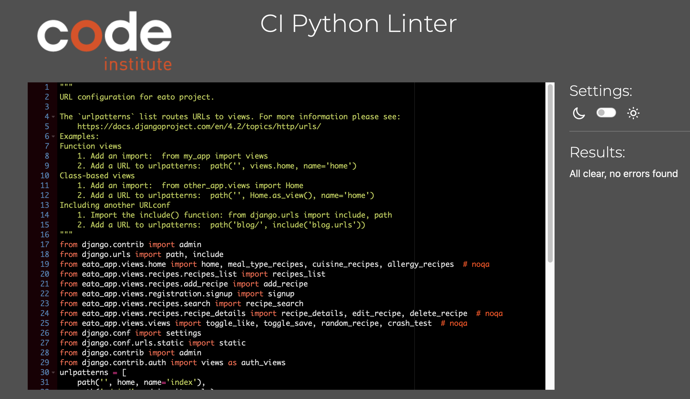
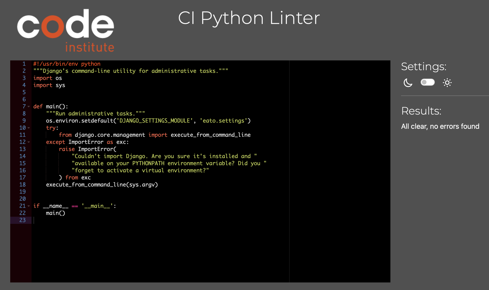
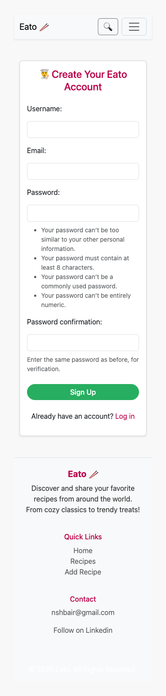
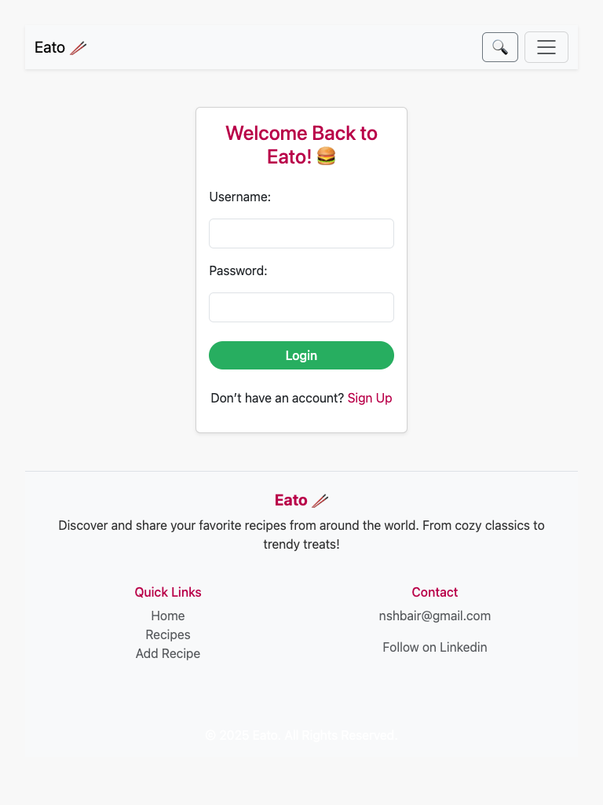
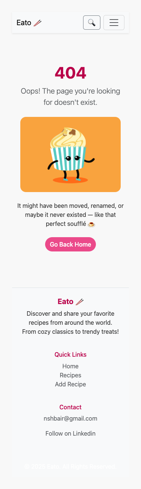

# Testing

> [!NOTE]
> Return back to the [README.md](README.md) file.

## Code Validation

### HTML

I have used the recommended [HTML W3C Validator](https://validator.w3.org) to validate all of my HTML files.

| Directory | File | Screenshot | Notes |
| --- | --- | --- | --- |
| templates | [404.html](https://github.com/NourShbair/eato/blob/main/templates/404.html) |  | - |
| templates | [500.html](https://github.com/NourShbair/eato/blob/main/templates/500.html) |  | - |
| templates | [index.html](https://github.com/NourShbair/eato/blob/main/templates/index.html) |  | - |
| templates | [add_recipe.html](https://github.com/NourShbair/eato/blob/main/templates/recipes/add_recipe.html) |  | - |
| templates | [delete_recipe.html](https://github.com/NourShbair/eato/blob/main/templates/recipes/delete_recipe.html) |  | - |
| templates | [edit_recipe.html](https://github.com/NourShbair/eato/blob/main/templates/recipes/edit_recipe.html) |  | - |
| templates | [recipe_details.html](https://github.com/NourShbair/eato/blob/main/templates/recipes/recipe_details.html) |  | - |
| templates | [recipes_list.html](https://github.com/NourShbair/eato/blob/main/templates/recipes/recipes_list.html) |  | - |
| templates | [search_results.html](https://github.com/NourShbair/eato/blob/main/templates/recipes/search_results.html) |  | - |
| templates | [login.html](https://github.com/NourShbair/eato/blob/main/templates/registration/login.html) |  | - |
| templates | [signup.html](https://github.com/NourShbair/eato/blob/main/templates/registration/signup.html) |  | - |


### CSS

I have used the recommended [CSS Jigsaw Validator](https://jigsaw.w3.org/css-validator) to validate all of my CSS files.

| Directory | File | URL | Screenshot | Notes |
| --- | --- | --- | --- | --- |
| static | [style.css](https://github.com/NourShbair/eato/blob/main/static/css/style.css) | [Link](https://jigsaw.w3.org/css-validator/validator?uri=https://eato-15691513b61b.herokuapp.com) |  | No errors found |

### Python

I have used the recommended [PEP8 CI Python Linter](https://pep8ci.herokuapp.com) to validate all of my Python files.

| Directory | File | URL | Screenshot | Notes |
| --- | --- | --- | --- | --- |
| eato | [settings.py](https://github.com/NourShbair/eato/blob/main/eato/settings.py) | [PEP8 CI Link](https://pep8ci.herokuapp.com/https://raw.githubusercontent.com/NourShbair/eato/main/eato/settings.py) |  | - |
| eato | [urls.py](https://github.com/NourShbair/eato/blob/main/eato/urls.py) | [PEP8 CI Link](https://pep8ci.herokuapp.com/https://raw.githubusercontent.com/NourShbair/eato/main/eato/urls.py) |  | - |
| eato_app | [admin.py](https://github.com/NourShbair/eato/blob/main/eato_app/admin.py) | [PEP8 CI Link](https://pep8ci.herokuapp.com/https://raw.githubusercontent.com/NourShbair/eato/main/eato_app/admin.py) |  | - |
| eato_app | [models.py](https://github.com/NourShbair/eato/blob/main/eato_app/models.py) | [PEP8 CI Link](https://pep8ci.herokuapp.com/https://raw.githubusercontent.com/NourShbair/eato/main/eato_app/models.py) |  | - |
| eato_app | [tests.py](https://github.com/NourShbair/eato/blob/main/eato_app/tests.py) | [PEP8 CI Link](https://pep8ci.herokuapp.com/https://raw.githubusercontent.com/NourShbair/eato/main/eato_app/tests.py) |  | - |
|  | [manage.py](https://github.com/NourShbair/eato/blob/main/manage.py) | [PEP8 CI Link](https://pep8ci.herokuapp.com/https://raw.githubusercontent.com/NourShbair/eato/main/manage.py) |  | - |
| eato_app | [views.py](https://github.com/NourShbair/eato/blob/main/eato_app/views/views.py) | [PEP8 CI Link](https://pep8ci.herokuapp.com/https://raw.githubusercontent.com/NourShbair/eato/main/eato_app/views/views.py) |  | - |
| eato_app | [views.py](https://github.com/NourShbair/eato/blob/main/eato_app/views/views.py) | [PEP8 CI Link](https://pep8ci.herokuapp.com/https://raw.githubusercontent.com/NourShbair/eato/main/eato_app/views/views.py) |  | - |
| eato_app | [views.py](https://github.com/NourShbair/eato/blob/main/eato_app/views/views.py) | [PEP8 CI Link](https://pep8ci.herokuapp.com/https://raw.githubusercontent.com/NourShbair/eato/main/eato_app/views/views.py) |  | - |
| eato_app | [views.py](https://github.com/NourShbair/eato/blob/main/eato_app/views/views.py) | [PEP8 CI Link](https://pep8ci.herokuapp.com/https://raw.githubusercontent.com/NourShbair/eato/main/eato_app/views/views.py) |  | - |
| eato_app | [views.py](https://github.com/NourShbair/eato/blob/main/eato_app/views/views.py) | [PEP8 CI Link](https://pep8ci.herokuapp.com/https://raw.githubusercontent.com/NourShbair/eato/main/eato_app/views/views.py) |  | - |
| eato_app | [views.py](https://github.com/NourShbair/eato/blob/main/eato_app/views/views.py) | [PEP8 CI Link](https://pep8ci.herokuapp.com/https://raw.githubusercontent.com/NourShbair/eato/main/eato_app/views/views.py) |  | - |
| eato_app | [views.py](https://github.com/NourShbair/eato/blob/main/eato_app/views/views.py) | [PEP8 CI Link](https://pep8ci.herokuapp.com/https://raw.githubusercontent.com/NourShbair/eato/main/eato_app/views/views.py) |  | - |


## Responsiveness

I've tested my deployed project to check for responsiveness issues.

| Page | Mobile | Tablet | Desktop | Notes |
| --- | --- | --- | --- | --- |
| Register |  |  |  | Works as expected |
| Login |  |  |  | Works as expected |
| Home |  |  |  | Works as expected |
| Add Recipe |  |  |  | Works as expected |
| Edit Recipe |  |  |  | Works as expected |
| Delete Recipe |  |  |  | Works as expected |
| Recipes List |  |  |  | Works as expected |
| Recipe Details |  |  |  | Works as expected |
| 404 |  |  |  | Works as expected |


## Browser Compatibility

I've tested my deployed project on multiple browsers to check for compatibility issues.

| Page | Chrome | Firefox | Safari | Notes |
| --- | --- | --- | --- | --- |
| Register |  |  |  | Works as expected |
| Login |  |  |  | Works as expected |
| Home |  |  |  | Works as expected |
| Add Recipe |  |  |  | Works as expected |
| Edit Recipe |  |  |  | Works as expected |
| Delete Recipe |  |  |  | Works as expected |
| Recipes List |  |  |  | Works as expected |
| Recipe Details |  |  |  | Works as expected |
| 404 |  |  |  | Works as expected |

## Lighthouse Audit

I've tested my deployed project using the Lighthouse Audit tool to check for any major issues. Some warnings are outside of my control, and mobile results tend to be lower than desktop.

| Page | Mobile | Desktop |
| --- | --- | --- |
| Register |  |  |
| Login |  |  |
| Home |  |  |
| Recipes List |  |  |
| Recipe Details |  |  |
| 404 |  |  |

## Defensive Programming

Defensive programming was manually tested with the below user acceptance testing:

| Page | Expectation | Test | Result | Screenshot |
| --- | --- | --- | --- | --- |
| Register | Prevent submission with missing fields. | Attempted to register with blank username and password fields. | Error message displayed: "This field is required". |  |
| Register | Prevent registration with existing username. | Tried registering with a username that already exists. | Error shown: "A user with that username already exists". |  |
| Login | Prevent login with incorrect credentials. | Entered wrong password for a valid user. | Login failed with error: "Please enter a correct username and password". |  |
| Add Recipe | Prevent recipe submission without required fields. | Tried submitting recipe without title, instructions, or image. | Field-specific validation errors displayed. |  |
| Add Recipe | Prevent invalid image uploads. | Attempted to upload a .txt file as an image. | Error shown: "Upload a valid image. The file you uploaded was either not an image or a corrupted image". |  |
| Add Recipe | Prevent ingredient submission with missing data. | Tried to submit ingredient row with empty name or quantity. | Ingredient row rejected; user prompted to complete all fields. |  |
| User Authentication | Feature is expected to allow registered users to log in to the site. | Attempted to log in with valid and invalid credentials. | Login was successful with valid credentials; invalid credentials were rejected. |  |
| Recipe Details | Handle non-existent recipe ID. | Accessed /recipe/9999/ where ID doesn't exist. | Custom 404 page displayed. |  |
| Search | Handle empty query gracefully. | Searched with no keyword. | Page loads with message: “No results found” or empty results. |  |
| Search | Prevent search crash on special characters. | Searched using !@#$%^&*(). | No crash; search handled safely. |  |
| Like Recipe | Prevent duplicate likes. | Liked the same recipe twice. | Only one like recorded per user. |  |
| Save Recipe | Prevent duplicate saves. | Tried saving the same recipe multiple times. | Recipe saved once; no duplicates created. |  |
| Edit Recipe | Block unauthorized users from editing others' recipes. | Logged in as user A and tried to access edit page for user B's recipe. | Access denied (403) or redirected to homepage. |  |
| Delete Recipe | Require confirmation or permissions. | Tried deleting recipe directly via URL. | Deletion blocked for unauthorized user or confirmed for owner. |  |
| Logout | Ensure session termination. | Logged out and attempted to access protected page. | Redirected to login page. |  |
| 404 Error Page | Feature is expected to display a 404 error page for non-existent pages. | Navigated to an invalid URL (e.g., `/error`). | A custom 404 error page was displayed as expected. |  |
| 500 Error Page | Feature is expected to display a 500 error page for crash-exist pages. | Navigated to an invalid URL (e.g., `/crash`). | A custom 500 error page was displayed as expected. |  |


## User Story Testing

| Target | Expectation | Outcome | Screenshot |
| --- | --- | --- | --- |
| As a user | I would like to register for an account | so that I can create and manage my own recipes |  |
| As a registerd user | I would like to log in to my account | so that I can access my saved and created recipes |  |
| As a registerd user | I would like to add a new recipe with a title, image, ingredients, and instructions | so that I can preserve and share my cooking methods |  |
| As a registerd user | I would like to edit or delete my own recipes | so that I can update them over time or remove them when necessary |  |
| As a registerd user | I would like to assign meal types, cuisine, and allergy tags to recipes | so that others can easily discover and filter suitable dishes |  |
| As a registerd user | I would like to upload and preview a recipe image | so that my recipe posts are more visually appealing |  |
| As a registerd user | I would like to save (bookmark) recipes I like | so that I can return to them easily later |  |
| As a registerd user | I would like to like a recipe | so that I can show appreciation and see popular dishes |  |
| As a user | I would like to view all the recipes I’ve saved or liked | so that I can revisit my favorites quickly |  |
| As a user | I would like to search recipes by title or ingredient | so that I can quickly find something specific to cook |  |


## Automated Testing

I have conducted a series of automated tests on my application.

> [!NOTE]
> I fully acknowledge and understand that, in a real-world scenario, an extensive set of additional tests would be more comprehensive.

### JavaScript (Jest Testing)

I have used the [Jest](https://jestjs.io) JavaScript testing framework to test the application functionality. In order to work with Jest, I first had to initialize NPM.

- `npm init`
- Hit `<enter>` for all options, except for **test command:**, just type `jest`.

Add Jest to a list called **Dev Dependencies** in a dev environment:

- `npm install --save-dev jest`

**IMPORTANT**: Initial configurations

When creating test files, the name of the file needs to be `file-name.test.js` in order for Jest to properly work. Without the following, Jest won't properly run the tests:

- `npm install -D jest-environment-jsdom`

Due to a change in Jest's default configuration, you'll need to add the following code to the top of the `.test.js` file:

```js
/**
 * @jest-environment jsdom
 */

const { test, expect } = require("@jest/globals");
const { function1, function2, function3, etc. } = require("../script-name");

beforeAll(() => {
    let fs = require("fs");
    let fileContents = fs.readFileSync("index.html", "utf-8");
    document.open();
    document.write(fileContents);
    document.close();
});
```

Remember to adjust the `fs.readFileSync()` to the specific file you'd like you test. The example above is testing the `index.html` file.

Finally, at the bottom of the script file where your primary scripts are written, include the following at the very bottom of the file. Make sure to include the name of all of your functions that are being tested in the `.test.js` file.

```js
if (typeof module !== "undefined") module.exports = {
    function1, function2, function3, etc.
};
```

Now that these steps have been undertaken, further tests can be written, and be expected to fail initially. Write JS code that can get the tests to pass as part of the Red-Green refactor process. Once ready, to run the tests, use this command:

- `npm test`

**NOTE**: To obtain a coverage report, use the following command:

- `npm test --coverage`

Below are the results from the tests that I've written for this application:

| Test Suites | Tests | Screenshot |
| --- | --- | --- |
| 1 passed | 16 passed |  |

### Python (Unit Testing)

I have used Django's built-in unit testing framework to test the application functionality. In order to run the tests, I ran the following command in the terminal each time:

- `python3 manage.py test eato-app`

To create the coverage report, I would then run the following commands:

- `pip3 install coverage`
- `pip3 freeze --local > requirements.txt`
- `coverage run --omit=*/site-packages/*,*/migrations/*,*/__init__.py,env.py,manage.py test`
- `coverage report`

To see the HTML version of the reports, and find out whether some pieces of code were missing, I ran the following commands:

- `coverage html`
- `python3 -m http.server`

Below are the results from the full coverage report on my application that I've tested:


#### Unit Test Issues

| Issue | Description | Solution |
| --- | --- | --- |
| AttributeError: 'Recipe' object has no attribute 'ingredients' | Occurs when trying to access .ingredients directly on Recipe object, but relationship is managed via RecipeIngredient (through model). | Fixed by querying RecipeIngredient.objects.filter(recipe=...) instead. |
| TypeError: Ingredient() got an unexpected keyword argument | Happens when trying to create an Ingredient with quantity and unit, which actually belong to the RecipeIngredient model. | Fixed by creating Ingredient separately, then creating RecipeIngredient to attach quantity/unit. |
| cloudinary.exceptions.Error: Invalid image file | Raised when using a fake or improperly formatted image in tests with CloudinaryField. | Fixed by creating Ingredient separately, then creating Fixed by generating a valid in-memory JPEG using PIL and BytesIO. |

## Bugs

⚠️ INSTRUCTIONS ⚠️

Nobody likes bugs,... except the assessors! Projects seem more suspicious if a student doesn't properly track their bugs. If you're about to submit your project without any bugs listed below, you should ask yourself why you're doing this course in the first place, if you're able to build this entire application without running into any bugs. The best thing you can do for any project is to document your bugs! Not only does it show the true stages of development, but think of it as breadcrumbs for yourself in the future, should you encounter the same/similar bug again, it acts as a gentle reminder on what you did to fix the bug.

If/when you encounter bugs during the development stages of your project, you should document them here, ideally with a screenshot explaining what the issue was, and what you did to fix the bug.

Alternatively, an improved way to manage bugs is to use the built-in **[Issues](https://www.github.com/NourShbair/eato/issues)** tracker on your GitHub repository. This can be found at the top of your repository, the tab called "Issues".

If using the Issues tracker for bug management, you can simplify the documentation process for testing. Issues allow you to directly paste screenshots into the issue page without having to first save the screenshot locally. You can add labels to your issues (e.g. `bug`), assign yourself as the owner, and add comments/updates as you progress with fixing the issue(s). Once you've solved the issue/bug, you should then "Close" it.

When showcasing your bug tracking for assessment, you can use the following examples below.

⚠️ --- END --- ⚠️

### Fixed Bugs

[](https://www.github.com/NourShbair/eato/issues?q=is%3Aissue+is%3Aclosed+label%3Abug)

I've used [GitHub Issues](https://www.github.com/NourShbair/eato/issues) to track and manage bugs and issues during the development stages of my project.

All previously closed/fixed bugs can be tracked [here](https://www.github.com/NourShbair/eato/issues?q=is%3Aissue+is%3Aclosed+label%3Abug).


### Unfixed Bugs

⚠️ INSTRUCTIONS ⚠️

You will need to mention any unfixed bugs and why they are not fixed upon submission of your project. This section should include shortcomings of the frameworks or technologies used. Although time can be a big variable to consider, paucity of time and difficulty understanding implementation is not a valid reason to leave bugs unfixed. Where possible, you must fix all outstanding bugs, unless outside of your control.

If you've identified any unfixed bugs, no matter how small, be sure to list them here! It's better to be honest and list them, because if it's not documented and an assessor finds the issue, they need to know whether or not you're aware of them as well, and why you've not corrected/fixed them.

⚠️ --- END --- ⚠️

[](https://www.github.com/NourShbair/eato/issues)

Any remaining open issues can be tracked [here](https://www.github.com/NourShbair/eato/issues).


### Known Issues

| Issue | Screenshot |
| --- | --- |
| On devices smaller than 375px, the page starts to have horizontal `overflow-x` scrolling. |  |
| When validating HTML with a semantic `<section>` element, the validator warns about lacking a header `h2-h6`. This is acceptable. |  |
| Validation errors on "signup.html" coming from the Django Allauth package. |  |

> [!IMPORTANT]
> There are no remaining bugs that I am aware of, though, even after thorough testing, I cannot rule out the possibility.

